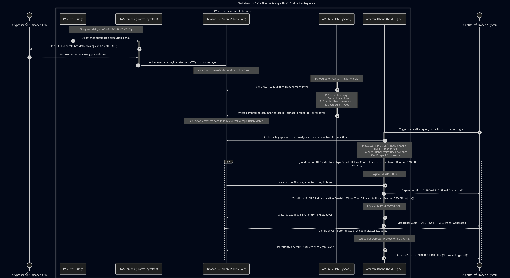

# Binance-Data-Engineering-Project

# MarketMatrix 📊🚀
**Cryptocurrency Trading Prediction**

MarketMatrix is a data engineering solution that automates the extraction, processing, and analysis of cryptocurrency data (Bitcoin) to generate accurate trading signals. The system uses a *serverless* architecture on AWS to ensure scalability and cost efficiency.

## 🎯 Project Objective
The main objective is to answer the fundamental business question:
> "What is the statistically optimal moment to execute a trading operation with any cryptocurrency that maximizes the probability of profit and minimizes risk?"

## 🔍 Specific Project Objectives

- Ingest price and volume data from the Binance API.
- Store raw data in Amazon S3.
- Clean, validate, and transform the data.
- Convert clean data to improve query performance.
- Query the prepared data with Amazon Athena.
- Apply decision rules based on RSI, Bollinger Bands, and MACD.
- Generate a final recommendation: strong buy, sell, or hold.
- Maintain data traceability from ingestion to the final analytical layer.

## 🏗️ System Architecture
The system follows the **Medallion Architecture** design pattern (Bronze, Silver, and Gold layers).

*Flow Diagram: EventBridge -> Lambda -> S3 -> Glue -> Athena*

### 🛠️ Development Stack
- **Extraction:** Python (Boto3, Requests) & Binance API.
- **Orchestration:** AWS EventBridge (Cron jobs).
- **Compute:** AWS Lambda (Serverless).
- **Storage:** Amazon S3 (Data Lake).
- **Processing/ETL:** AWS Glue & PySpark.
- **Querying/Analytics:** Amazon Athena (SQL).

## 📊 The Data Pipeline

### 1. Bronze Layer (Raw Data)
- **Frequency:** Daily (00:05 UTC / 18:05 CDMX).
- **Format:** CSV.
- **Description:** Captures the daily Binance candlestick right after the official close, ensuring immutable and complete data.

### 2. Silver Layer (Processed Data)
- **Process:** AWS Glue Job.
- **Format:** Parquet (Optimized for analytics).
- **Description:** Data cleaning, duplicate removal, and data type transformation to reduce scan costs in Athena.

### 3. Gold Layer (Business Rules)
- **Interface:** Views in Amazon Athena.
- **Logic:** Implementation of the **Triple Confirmation Rule**.
- **Indicators:** RSI, Bollinger Bands, and MACD.

## 🛡️ Business Rules (Trading Logic)
The "Gold Layer" issues recommendations based on strict mathematical criteria:

| Status | Technical Condition |
| :--- | :--- |
| **STRONG BUY** | RSI ≤ 30 + Price < Lower Bollinger Band + MACD Bullish Crossover |
| **SELL** | RSI ≥ 70 + Price > Upper Bollinger Band + MACD Bearish Crossover |
| **HOLD** | When the entry or exit criteria are not met simultaneously. |

## 💰 Cost Analysis (AWS Serverless)
The system has been optimized to operate within the **Free Tier** of AWS:
- **Lambda & S3:** ~$0.00 USD (within the free limit).
- **Athena:** ~$0.01 USD for every 2GB scans.
- **Automation Option:** The total automation from Glue was evaluated, this would increment the cost about 1,000% (from $0.05 to $0.50USD monnthly), keeping economic viability for this project

---
