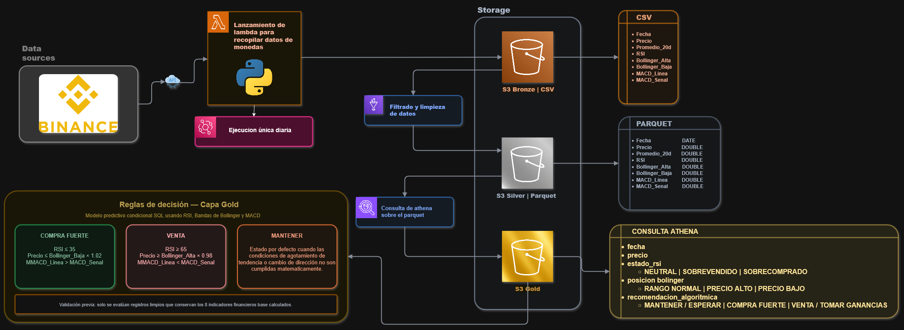

# Binance-Data-Engineering-Project

# MarketMatrix 📊🚀
**Prediccion de Trading de Criptomonedas**

MarketMatrix es una solución de ingeniería de datos que automatiza la extracción, procesamiento y análisis de datos de criptomonedas (Bitcoin) para generar señales de trading precisas. El sistema utiliza una arquitectura *serverless* en AWS para garantizar escalabilidad y eficiencia de costos.

## 🎯 Propósito del Proyecto
El objetivo principal es responder a la pregunta fundamental de negocio: 
> "¿Cuál es el momento estadísticamente óptimo para realizar una operación de trading con cualquier criptomoneda que maximice la probabilidad de ganancia y minimice el riesgo?"

## 🏗️ Arquitectura del Sistema
El sistema sigue el patrón de diseño de **Medallion Architecture** (Capa Bronze, Silver y Gold).

*Diagrama de flujo: EventBridge -> Lambda -> S3 -> Glue -> Athena*

### 🛠️ Tech Stack
- **Extracción:** Python (Boto3, Requests) & Binance API.
- **Orquestación:** AWS EventBridge (Cron jobs).
- **Cómputo:** AWS Lambda (Serverless).
- **Almacenamiento:** Amazon S3 (Data Lake).
- **Procesamiento/ETL:** AWS Glue & PySpark.
- **Consultas/Analítica:** Amazon Athena (SQL).

## 📊 El Pipeline de Datos

### 1. Capa Bronze (Raw Data)
- **Frecuencia:** Diaria (00:05 UTC / 18:05 CDMX).
- **Formato:** CSV.
- **Descripción:** Captura la vela diaria de Binance justo después del cierre oficial, asegurando datos inmutables y completos.

### 2. Capa Silver (Processed Data)
- **Proceso:** AWS Glue Job.
- **Formato:** Parquet (Optimizado para analítica).
- **Descripción:** Limpieza de datos, eliminación de duplicados y transformación de tipos de datos para reducir costos de escaneo en Athena.

### 3. Capa Gold (Business Rules)
- **Interfaz:** Vistas en Amazon Athena.
- **Lógica:** Implementación de la **Regla de Triple Confirmación**.
- **Indicadores:** RSI (14), Bandas de Bollinger (20, 2) y MACD (12, 26, 9).

## 🛡️ Reglas de Negocio (Trading Logic)
La "Capa Gold" emite recomendaciones basadas en criterios matemáticos estrictos:

| Estado | Condición Técnica |
| :--- | :--- |
| **COMPRA FUERTE** | RSI ≤ 30 + Precio < Banda Inf. Bollinger + Cruce Alcista MACD |
| **VENTA** | RSI ≥ 70 + Precio > Banda Sup. Bollinger + Cruce Bajista MACD |
| **MANTENER** | Cuando no se cumplen simultáneamente los criterios de entrada o salida. |

---
Desarrollado por Equipo 2 - MarketMatrix como parte del proyecto de Ingeniería de Datos.
